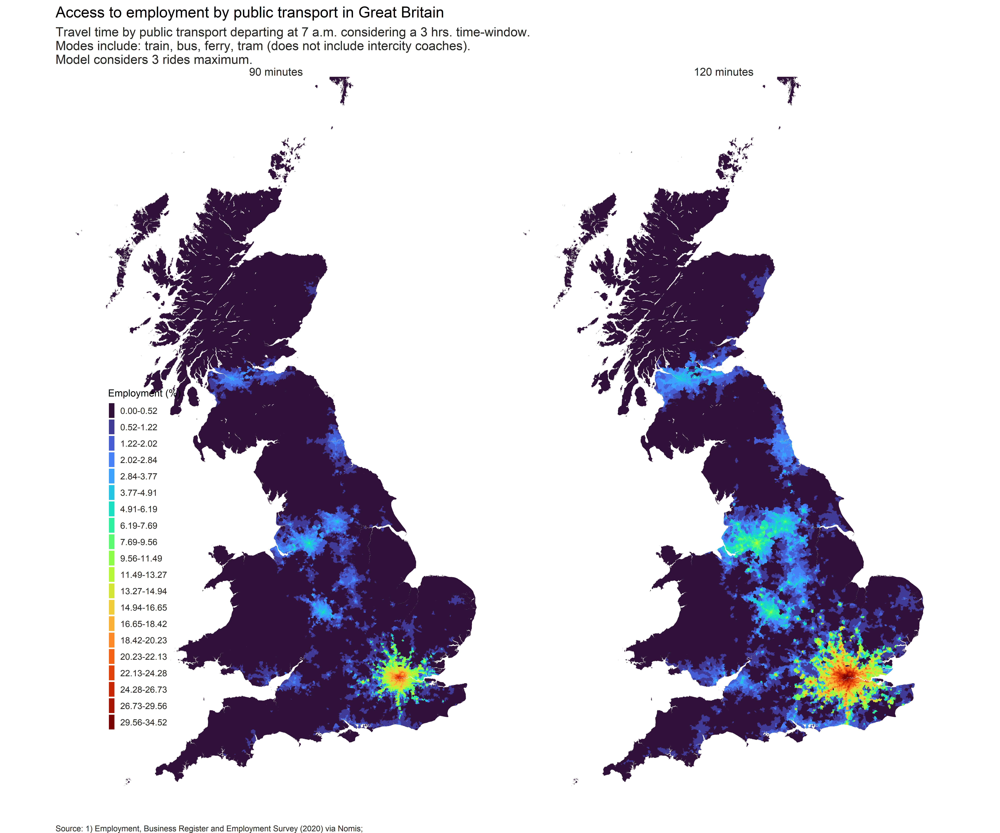

<style>
body {
text-align: justify}
</style>

```{r setup, include=FALSE}
knitr::opts_chunk$set(echo = FALSE, message = FALSE, warning = FALSE)
```


```{r}
# Packages
library(kableExtra)
library(tidyverse)
# Fn format big number
format2 <- function(x, digits = 2)  formatC(x, format="f", big.mark=" ", digits=digits)
```


# Overview

Understanding how access to amenities by public transport varies across space is important in a wide variety of urban research. For instance, how is access related to risks of unemployment? How does access to urban amenities capitalise into land prices? Does good accessibility drive gentrification? Much research has focused on distance-based measures because they are relatively straightforward to derive. However, they often assume access to a car since mobility is seen as being equally possible in all directions. This is not a justifiable assumption in many cases, particularly for lower income groups in urban areas. It would therefore be useful to have accessibility measures which assume travel by public transport.

The present work addresses this unmet need. It offers a series of accessibility indicators at the level of the Lower Super Output Area/Datazone (LSOA/DZ) covering the whole of Great Britain (GB) in the United Kingdom (UK). Indicators by public transport include a range of key amenities and services such as: employment; general practice (GP) surgery; hospital; grocery store; supermarket; primary school; secondary school; and urban centre. 

Code to create the derived indicators is openly available for other researchers to use and customise in the following GitHub repository: <https://github.com/rafavdz/access_uk_open>.


# Accessibility

Accessibility indicators are well-established measures representing "the ease of reaching valued destinations" [@Levinson2020, p. 130]. These measures can be grouped in four broad classes [@Geurs2004]: (1) infrastructure-based; (2) location-based; (3) person-based, and; (4) utility-based. The most common of these is the *location-based* since are relatively easy to interpret and are still comprehensive enough to capture the characteristics of the infrastructure, land use, and persons. A general formulation of location-based accessibility measures is the following [@Paez2012]:

$$
A_{ik} = \sum_{j} g(W_{jk}) f(c_{ij})
$$

Here, accessibility is estimated from location $i$ (an origin) for type of opportunities $k$. This is given by a function of the size of opportunities $W$ of type $k$ at location $j$ (a destination). Usually, this is represented by the number of opportunities of type $k$ in $j$. Opportunities are weighted by a function of the cost of travelling between the origin and destination denoted by $c_{ij}$. This last component is referred to as *impedance*. In the urban and regional context, the travel costs are often represented as travel time, as this include a range of details in the local context, e.g. connectivity, frequency/availability of public transport services, or the topology of the road and pedestrian network.

Impedance can take several forms [@Kwan1998]. One of the simplest is the *rectangular* function which expressed as following:

$$
\begin{aligned}
  f(c_{ij})= \left\{
      \begin{array}{ll}
          1 & \quad \text{if }c_{ij} \leq \bar{t} \text{ (threshold value)} \\
          0 & \quad \text{otherwise},
      \end{array}
    \right.
\end{aligned}
$$
where $\bar{t}$ is a threshold value which defines the value of impedance as '1' if the travel time is equal or lower than this or '0' otherwise. This parameter assume people are equally happy to consider opportunities within a maximum travel time journey and will consider nothing beyond that threshold. The rectangular function gives rise to the *cumulative* accessibility measure, which can be verbally expressed as *the total number of opportunities that can be reached within a threshold value*. The notation for cumulative accessibility measures is as following:

$$
\begin{aligned}
  A_{ik} & = \sum_{j} W_j f(c_{ij}) \\
  f(c_{ij}) &= \left\{
      \begin{array}{ll}
          1 & \quad \text{if }c_{ij} \leq \bar{t} \text{ (threshold value)} \\
          0 & \quad \text{otherwise}.
      \end{array}
    \right.
\end{aligned}
$$

Cumulative accessibility measures are useful when opportunities are close substitutes and therefore have the potential to compete with each other, e.g. convenience stores, GP surgeries, jobs, etc. Alternative accessibility place-based measures are more suitable for services or destinations that are not easily interchangable and are therefore scarce [@Yuan2020], e.g. distance to closest amenity/service. This type of measure is referred to in literature as dual or minimum travel time [@Higgins2022].

Here, we calculate both of the place-based measures described above the cumulative and dual or minimum travel time according to the suitability of the opportunity being measured.

# Methods and sources {#Methods}

## Origins

Accessibility indicators were estimated for all 41,729 LSOA/DZ in Great Britain. Origins are represented by LSOA/DZ population weighted centroids based on the boundaries defined for the 2011 Census. The table below presents a summary of the origins employed by nation. LSOA's centroids for England and Wales were produced by the Office for National Statistics (ONS) and manually downloaded from the UK Government open data portal (<https://data.gov.uk/>) on the 2021-12-12 (version last updated on 2019-12-21). DZ centroids in Scotland are published by the Scottish Government and were manually downloaded from the UK Government's open data portal (<https://data.gov.uk/>) (version last updated on the 2021-03-26). As shown below, 32,844 origins are located in England, 6,976 in Scotland, and only 1,909 in Wales. The average number of inhabitants within LSOA/DZ for the year of reference 2020 is 1,562 and the mean surface area is 5.5 km^2. On average, zones in Wales and Scotland are larger than those in England. 

```{r}
# Origins summary
or_summ <- read_csv('supplemet/origins_summary.csv')
or_summ$`LSOA/DZ` <- c("Count (N)", "Population 2020 (mean)", "Surface area sq. km. (Mean) ")
# Print summary
or_summ %>% 
  # Format numbers
  mutate(across(England:`Great Britain`, ~ ifelse(
    grepl('Count', `LSOA/DZ`), 
    format2(.x, 0),
    format2(.x, 2)
  ))) %>% 
  # Table
  kbl(
    caption = 'Origins summary'
    ) %>% 
  kable_styling("striped")
```


## Destinations

Potential destinations are represented by a range of amenities and services, namely: employment, general practitioner's (GPs) surgeries, hospitals, primary schools, secondary schools, city, greater city, and food stores (supermarkets). The next table presents a summary of the number of potential destinations of each type by nation. The sources and criteria employed to select these are detailed below. 


```{r}
# Destination summary
destinaiton_summary <- read_csv('supplemet/destinations_summary.csv')
# Print summary
destinaiton_summary %>% 
  mutate(across(-destination, format2, 0)) %>% 
  kbl(
    col.names = c('Destination', names(destinaiton_summary)[-1]),
    caption = 'Destinations summary'
    ) %>% 
  kable_styling("striped")
```

The location of destinations is represented by the population weighted centroid of the LSOA/DZ where these lie. The preferred source of information to identify the corresponding LSOA/DZ was the original source of information. If this was not available, the LSOA/DZ code was spatially joined to the services/amenities using the coordinates of destinations at the point level. If this was not available, a spatial join was performed using the coordinates of destinations at the point level and the LSOA/DZ boundaries. The spatial definition of the LSOA/DZ areal units was obtained from the [UK Data Service Census Support boundary dataset](http://census.ukdataservice.ac.uk/get-data/boundary-data.aspx). When the coordinates of the destination were not available, the post code (6 digits) was used to match the information with that of ONS Postcode Directory (ONSPD, edition August 2021) accessed online via the Open Geography Portal on: <https://geoportal.statistics.gov.uk/>). The ONSPD includes the corresponding LSOA/DZ code for each post code defined for the 2011 Census.

### Destination sources and selection criteria

The table below provides the list of sources employed to account for potential destination by country. It also includes the date of reference for the data employed. The preferred edition of the data was the closest available to the 22nd of November 2021 (the date of departure used for the estimation of travel time).

```{r}
# Read summary
destination_source <- read_csv('supplemet//destination_sources.csv')
# Exclude notes
destination_source <- filter(destination_source, Detail != 'Note')
# Define name of row groups
type_dest <- unique(destination_source$`Type destination`)
row_index <- rep(2, length(type_dest))
names(row_index) <- type_dest
# Print table
destination_source[,-1] %>% 
  kbl(caption = 'Destionation sources') %>% 
  kable_styling("striped") %>% 
  pack_rows(index = row_index)
```

#### Employment

The data used related to employment opportunities was obtained from the *Business Register and Employment Survey* and accessed via [Nomis](https://www.nomisweb.co.uk/) for all the locations in GB. The date of reference is the year 2020. This was the latest version available at the time of accessing. The information was aggregated by the issuer at the LSOA level for England and Wales and the DZ level for Scotland. The employment count **includes** persons who are 16 or over and are directly remunerated for performing a part-time or full-time job position in any industry. The figures consider employees plus the number of working owners. It **excludes** voluntary workers, self-employed, working owners who are not paid via PAYE.

#### GPs

GP data for England and Wales was obtained from the National Health Service (NHS) Digital web platform ([NHS Digital](https://digital.nhs.uk)) using the 'epraccur' dataset. The date of reference is November 2021 (Downloaded on November 26 of 2021). The data is provided at the individual GP surgery level. The following filters were implemented to include: 

* Records identified as "Active", and; 
* Prescribing setting is "GP Practice" only. This filter excludes any other setting category, for example: "Other", "WIC Practice", "OOH Practice", "Community health service", "Police Custody", or "Optometry Service".

Information about GPs in Scotland comes from the 'Practice details' dataset published by [Public Health Scotland](https://www.isdscotland.org/). The date of reference is October 2021. The records include: 

* Dispensing practices, and;
* Type of practice is '17C', '17J', or '2C' (This classification defines the type of contract, e.g. run by NHS, and/or other partners).

More information about the definitions employed in the data can be found [here](https://www.isdscotland.org/Health-Topics/General-Practice/Workforce-and-Practice-Populations/Glossary/). Since the Scottish data does not contain explicit information about the opening or closing date, all records are assumed to be active.

#### Hospitals

There is not an agreed definition to characterize health services to be regarded as a general *hospital* in Great Britain. This results in heterogeneity of criteria employed to collect and organize the data by the issuers. In addition, the lack of a consolidated sources across the countries makes it challenging to implement a meticulous selection process. The filtering criteria draws on that used in the Journey Time Statistics (JTS) [@DfT2019] which uses key words aimed at identifying and **excluding** the following type of establishments:

* Specialist hospitals, key words: 'birth', 'maternity', ' eye', 'rheumatic', 'throat', ' nose ', ' ear', 'neurology', 'neurosurgery', 'specialist emergency care', 'orthopaedic', 'heart hospital', 'children' or 'dental';
* Mental health, psychiatric, learning disability, or elder care hospitals, key words: 'mental', 'psychiatry', 'psychiatric', 'elder, 'elderly', 'learning disability', 'learning disabilities', or 'psychogeriatric';
* Day hospitals, key words: 'day hospital' or 'day care';
* Committee, key word: 'Committee'

This criteria was used to find establishments containing the aforementioned key words in the name of the establishment for all data sources detailed below.

The information for the establishments in England was accessed from the [NHS UK](https://www.nhs.uk/about-us/nhs-website-datasets/) website on the 6th of January 2022 (files are updated daily). In addition to the criteria described above, the records which were lablled as 'Mental Health Hospital' in the sub-type were excluded. 

Data for Scottish establishments was obtained from [Public Health Scotland](https://www.opendata.nhs.scot/) using the 'Hospital Codes' file for the date of reference January 2022. The selection process for this data set draws solely on the procedure outlined above.

The data used for Wales was assembled from a hospital directory published by the [Health in Wales](http://www.wales.nhs.uk/) website. The information was consulted on January 2022. An initial cleansing was carried out based on the classification offered by the source, where the following type of services were excluded: 'CHC Local Committee', 'Psychiatric', 'Elderly Mental', or 'Day Hospital'. The key-word filtering process was also implemented afterwards.

#### Education: primary schools and secondary schools

The source for the primary and secondary schools in England is the Department for Education (DfE). The  ‘All establishment data’ set was accessed via the [Get Information about Schools](https://get-information-schools.service.gov.uk/) (GIAS) web platform. The date of reference is November 2021. The filtering criteria follows that established for the JTS. This criteria includes:

* Open establishments (at the date of reference);
* Schools where the admission policy is not 'Selective';
* Type of establishment is one of the following: 
    * 'Community school',
    * 'Voluntary aided school',
    * 'Voluntary controlled school',
    * 'Foundation school',
    * 'Academy sponsor led',
    * 'Academy converter',
    * 'Free schools',
    * 'University technical college',
    * 'Studio schools'.

A primary school was defined if the phase of education is 'Primary, 'Middle deemed primary', or 'All-through'.

A secondary school is defined when:
* The phase of education is 'Secondary', 'Middle deemed secondary', or 'All-through',
* The statutory low age is less than 16, and
* The statutory high age is greater or equal to 16.

The source of information for schools in Scotland is the school education statistics collection published by [Scottish Government](https://www.gov.scot/). The set employed is the ['School contact details'](https://www.gov.scot/publications/school-contact-details/) for the date of reference 13th of September 2021. The primary/secondary classification of schools used was the same included by the source. 

Details on Welsh schools were accessed from [Address list of schools in Wales](https://gov.wales/address-list-schools#description-block) published by the [Welsh Government services and information](https://gov.wales/) website. The date of reference is January 2022. A school was considered as primary school if the sector category was 'Primary or 'Middle'. A school was deemed as secondary if the sector label was 'Secondary' or 'Middle'. 

#### Supermarkets

The source of information used for supermarkets data is [OpenStreetMap](https://www.openstreetmap.org/) (OSM). This choice is aided by the limitations from official or open-data sources available covering the whole GB. The OSM data was retrieved through an [overpass API](https://overpass-api.de/) on February 2022 using the `osmdata` [@R-osmdata] software for the `R` programming language [@R-base].

The feature defining the OSM query is specified using the following criteria:

* Bounding box/area corresponds to the whole UK,
* *key* is equal to 'shop', 
* *value* is equal to 'supermarket',
* The key and value are set to be interpreted exactly disregarding case characters.

The raw results were transformed in to vector data as point or polygon geometries (multipolygons were discarded). The point elements were included if the name of the establishment was not missing. Records that included polygon information were included if the floor area was larger than 280 m^2^, according to the [Sunday Trading Act 1994](https://commonslibrary.parliament.uk/research-briefings/sn05522/) (the STA 1994). Later, the geometric centroid was computed and combined with records including point information.

Further filters were implemented to refine the records as following: 

* The amenity field is not missing,
* The brand or name field matches one of the following key words:
    * 'Lidl', 
    * 'ALDI', 
    * 'Co-op', 
    * 'Sainsbury', 
    * 'Tesco',
    * 'Asda',
    * 'Morrisons'

Lastly, only elements within GB were kept. 

#### Urban centres

The location of the urban centres follows the method established by @Zhang2020 (<https://doi.org/10.1016/j.compenvurbsys.2012.10.003>). This is based on information from [OpenStreetMap](https://www.openstreetmap.org/) and functional economic regions given by [travel to work areas](https://data.gov.uk/dataset/30aced27-4b4e-4f28-a14b-e982a0fccb65/travel-to-work-areas-2011) (TTWA) as defined for the 2011 Census. The method identifies a *main* urban centre for each TTWA in GB and a set of *sub-centres* based on their population. See @Zhang2020 for more details.

The population estimates were represented by the LSOA/DZ level population weighted centroids used to represent the origins.

## Travel time estimates

The cost between origins and destinations in accessibility measures is represented by the estimated journey travel time. The software employed to model travel time is the `r5r` package [@R-r5r] version ‘0.6.0’ for the R programming language [@R-base], which draws on [R5](https://github.com/conveyal/r5) [@Conway2017; @Conway2018]. This is multimodal open-source routing engine which allows the computation of optimal door-to-door routes.  

The calculations use information from the road and pedestrian network and public transport schedules as the main input. The source of road and pedestrian network data used is [OpenStreetMap](OpenStreetMap) (OSM). The version employed is the latest as manually downloaded in `.PBF` format from the [Geofabric](https://download.geofabrik.de) web platform on the 2021-11-22 for Great Britain. The public transport timetables were obtained from the following sources: 

1. Bus [Open Data Service](https://www.gov.uk/transport/bus-services-routes-and-timetables) (BODS) which includes information related to the following modes: bus, tram, and ferry. The information was downloaded in general transit feed specification (GTFS) format on the 2022-11-22 via the 'All - Download timetables data in GTFS format' option which includes the timetables for the whole of GB, and; 
2. [Rail Delivery Group](https://www.raildeliverygroup.com/) which primarily  includes data on national rail passenger train services (heavy rail). This was manually downloaded on the 2022-11-22 in Common Interface File (CIF) format. The latter data was converted from CIF to GTFS format using the `UK2GTFS` [@R-UK2GTFS] software for `R`.

The travel time was estimated from each origin to every destination (represented by the LSOA/DZ population weighted centroid) in a travel time matrix according to the parameters described below.

### Model parameters

The modelling parameters follow those used in the Journey Time Statistics (JTS) [@DfT2019] developed by the Department of Transport (DfT) where possible. This decision is aimed at maintaining consistency and comparability to a certain extent. It should be noted that since the routing software and data sources used here and the JTS are different, it is not possible to specify all of the model's parameters equally. The criteria adopted for the present work is specified below.

The journey routes were calculated departing on Tuesday the 22nd of November 2021 at 07:00 a.m. [@DfT2019]. This is aimed at representing a typical weekday which is not affected by major national holidays. The maximum travel time allowed is limited to 120 minutes, regardless of the distance travelled. 

Public transport route estimates consider a combination of walking and all public transport modes included in the time-tables described earlier (i.e. bus, tram, light rail transit, ferry, and heavy rail. Note that inter-city coaches are not included due to the incompatibility of the format of data with the routing software used). The approach adopted is the door-to-door. This consider the time needed for the following stages: walking form the specific origin to a public transport station (access time), on-board duration on a public transport vehicle, transfer and on-board duration on the next vehicle, and walking from the last station to the final destination in the journey. Also, the estimates include the initial waiting time for boarding a public transport vehicle. This time varies according to the selected time of departure and the timetables of the services required for a journey. 

Variability of public transport journeys' travel time estimates is captured in `R5` drawing on bootstrap techniques [@Conway2018]. This allows the computation of a distribution density of feasible travel times over the selected time-window [@Conveyal]. From this distribution, a set of specific values termed time percentiles are selected. These percentiles represent the flexibility of travellers to adjust their time of departure within the selected time-window in order to minimize their waiting and overall travel time. Low time percentiles implies that the users are flexible to adapt their departure time according to the timetable whilst high percentiles are appropriate to represent users who do not rely on the schedules, e.g. in local journeys where the traveller expects to show-up and ride. The percentiles range from 0 to 100. While we produced the information for the 25th, 50th, and 75th percentile with the aim to provide more comprehensive information for the final users of the present data set, we used the 50th percentile (i.e. the median) for the computation of accessibility estimates.

Considering the above, the parameters employed for the computation of public transport journeys are the following:

* The time of departure considers a 3-hour time window (180 minutes) which covers the same period of time as previous work (JTS), i.e. from 7 am to 10 am. This is intended to capture the conditions at the morning peak for public transport routes.
* The maximum number of rides is set to 3. 
* The walking distance to egress/access public transport is not limited as long as the maximum travel time journey is not exceeded (120 minutes). This criterion implies that some of the routes can be completed by walking only if there is not a public transport service available or that enables an earlier time of arrival.
* The walking speed is set to 4.8 km/h (following the on road/path network adopted in the JTS).


# Ouputs

## Travel time matrix

The product of estimating the travel time from each origin to every potential destination results in a so-called all-to-all travel time matrix (TTM). The estimated TTM is included as an output since this can be used as the main input to customise or estimate new accessibility indicators according the needs the users of the present data collection. The table below presents a description of the contents of the `ttm/pt/descrip_ttm_pt.csv` file which includes the TTM for public transport.

```{r}
# Read summary
ttm_out <- read_csv('output/ttm/pt/descrip_ttm_pt.csv')
# Column names
ttm_colnames <- c('Variable', 'Type', 'Description')
# Print table
ttm_out %>% 
  kbl(caption = 'Travel time matrix by public transport', 
      col.names = ttm_colnames) %>% 
  kable_styling("striped")
```

## Accessibility indicators

The next table describes the accessibility indicators generated for each of the key services/amenities included in the present data collection. It includes: (1) the directory of the output file; (2) the accessibility measure computed for the respective service/amenity, namely cumulative, relative cumulative, and/or minimum travel time, and; (3) a description of the measure computed. 

```{r}
# Read summary
acces_out <- read_csv('output/accessibility/descrip_accessibility.csv')
# Column names
out_colnames <- c('File', 'Measure', 'Description')
# # Define name of row groups
desc_rowindex <- c("Employment" = 2, "GPs" = 3, "Hospitals" = 3, "Education: Primary schools and secondary schools" = 6, "Urban centre; city and greater city" = 2, "Supermarkets" = 3)
# Print table
acces_out[,-1] %>% 
  kbl(caption = 'Accessibility indicators', 
      col.names = out_colnames) %>% 
  kable_styling("striped") %>% 
  pack_rows(index = desc_rowindex)
```


### Visualization

The image below presents a visualization of one of the the accessibility indicators to employment as an example of the outputs produced. The indicator shown is estimated by public transport for the whole GB for two different time cuts, namely 90 minutes and 120 minutes.

```{r}
# Accessibility to employment multiple time cuts

```


# Limitations

Some important limitations of the work are outlined below:

* The transport model does not include intercity coaches (e.g. services provided by companies such as 'National Express' or 'Megabus'). This is due to the incompatible format used to publish their timetables.
* The location of destinations is represented by the respective LSOA/DZ population weighted centroid where the service/amenity falls and not the exact location of it.
* The heterogeneity of sources and/or systems accounting for destination between nations poses challenges resulting from the variability in the criteria employed for collecting data or originating from the actual compatibility of schooling systems. This specially affects hospitals and education establishments. Therefore, caution is advised for making comparison between locations across countries for these type of indicators.
* We are not aware of an consistent open access source of data including the location of supermarkets in GB. Therefore, the locations included account only for *major* brands and do not make a clear-cut distinction between a supermarket and a grocery-shop. This is also related to the lack of official or standard definitions across nations in GB.

# References